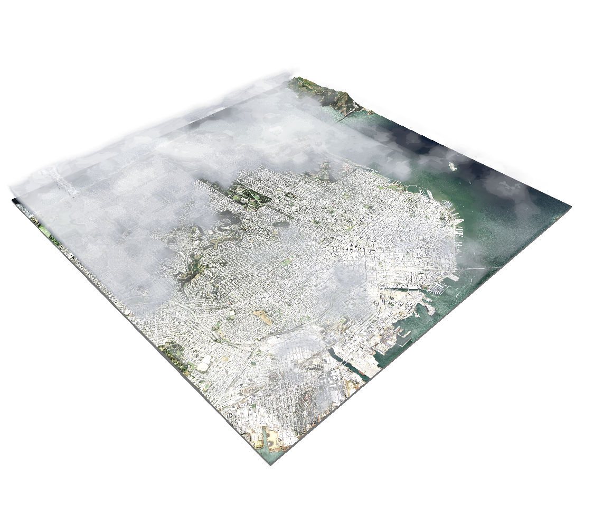

# SceneKit Volumetric Weather

### Overview

This project demonstrates how to create volumetric effects from map data using a Metal shader with SCNProgram. It's a companion to [this post](https://blog.mapbox.com/3d-weather-with-scenekit-aka-karl-the-fog-in-ar-931cff1c1c7c) about volumetric weather.

The example uses the most recent data from [Real Earth](http://realearth.ssec.wisc.edu/) to render volumetric clouds over San Francisco.

### Installation

Install the Mapbox SceneKit using [Carthage](https://github.com/Carthage/Carthage/):

1. Clone this repo.

1. Run `carthage update --platform iOS` to build the iOS dependencies.

1. Follow instructions 3-5 of [Carthage’s iOS integration instructions](https://github.com/Carthage/Carthage#if-youre-building-for-ios-tvos-or-watchos). Your application target’s Embedded Frameworks should include MapboxSceneKit.framework and MapboxMobileEvents.framework.

1. Add your [access token](https://www.mapbox.com/account/access-tokens/) to the `MGLMapboxAccessToken` field in info.plist.

### Troubleshooting

1. Because the sample uses up-to-date satellite imagery, clouds won't appear on clear days or after dark. To view a specific time of day, you can modify the tile request using [RealEarth's documentation](http://realearth.ssec.wisc.edu/doc/).

1. The volumetric rendering is done using a [Metal](https://developer.apple.com/metal/) shader, and isn't compatible with the iOS simulator. Build to a physical device for the best results.

### License

scenekit-volumetric-weather is [licensed under BSD2](https://github.com/mapbox/scenekit-volumetric-weather/blob/master/LICENSE.md). Attribution is not required, but definitely welcome! If you build something with this code, please mention it in your readme so that others can learn about the resource.
